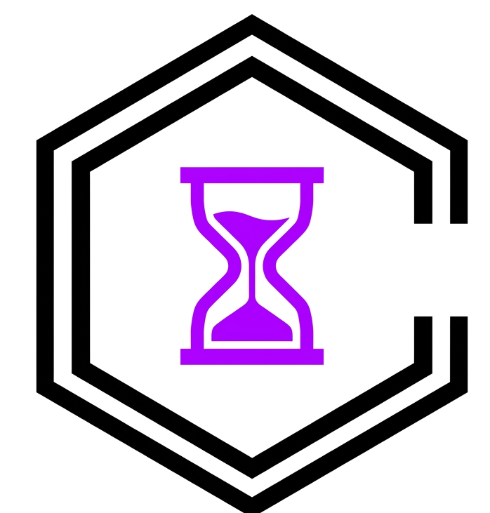
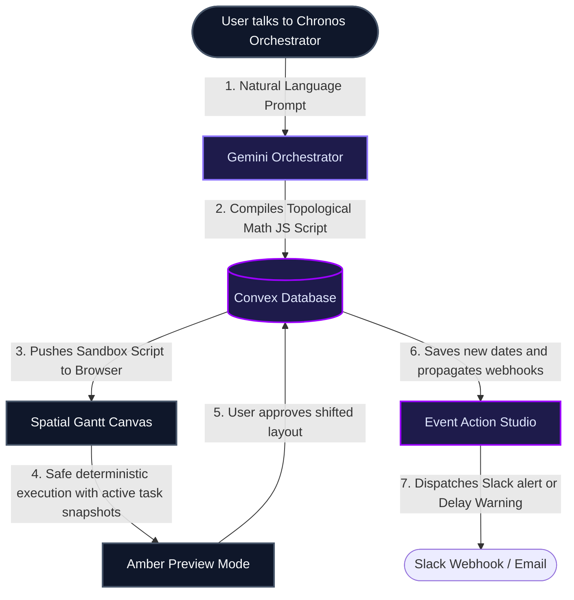

<div align="center">
  
  <h1>⏱️ Chronos — The AI-Native Timeline Orchestrator</h1>
  
  <p align="center">
    
    
    
    
    
  </p>
</div>

### Conversational Project & Process Orchestration

Chronos is an AI-native timeline and scheduling orchestrator that turns standard project roadmaps into live, reactive execution graphs. Built for high-stakes launch coordinates and complex dependency trees, Chronos bridges the gap between conversational brainstorming and structured calendar execution through topological rescheduling models and real-time Event-Action automations.

---

## Why Chronos?

Traditional project trackers (like raw Gantt charts or stale Kanban boards) require hours of manual administrative overhead when plans shift. When a single core API block delays, PMs have to manually drag dozens of downstream tasks.

Here is how Chronos solves this via a **Topological AI Sandbox**:

| Feature Dimension | Traditional Project Managers | The Chronos Engine |
| :--- | :--- | :--- |
| **Downstream Delays** | ❌ **Manual Dragging**. Moving a delayed task forces you to manually edit every blocked child block. | 🟢 **Recursive Date Reflow**. Automatically propagates date shifts forward across blocked dependency chains in milliseconds. |
| **Roadmap Ingestion** | ❌ **Hours of Setup**. Manually drafting 30 tasks, start/end dates, and tracks. | 🟢 **Conversational Blueprinting**. Describe plans in natural language; Chronos compiles and draws the complete timeline in seconds. |
| **Workflow Automations** | ❌ **Rigid Systems**. Complex configuration menus for simple webhooks. | 🟢 **Event Action Studio**. Describe rules in conversation to alert Slack channels or email teams when milestones are met or delayed. |
| **Self-Healing Math** | ❌ **Formula Errors**. LLM hallucinates wrong offsets or dates when prompting schedules. | 🟢 **Client-Side Sandbox**. AI rescheduling logic compiles and runs deterministically in a browser sandbox, catching typos automatically. |

---

## The Engine: Hybrid Temporal Architecture

Chronos uses a unique **Sandboxed Script Execution** strategy to coordinate topological calendar math safely in the client browser.

### Interactive Data Flow



---

## Core Features

-   **Conversational Blueprinting**: Describe high-level product release plans in a single prompt and watch Chronos draw styled multi-track roadmaps instantly.
-   **Recursive Date Reflow**: The temporal shift engine. When a task slips, Chronos automatically propagates the dates forward across dependent blocked chains.
-   **Amber Preview Mode**: Review proposed timeline shifts before saving. Chronos slides blocked tasks into preview slots and highlights warnings in amber.
-   **Event Action Studio**: Bind automation rules directly to milestones. Trigger mock Slack notifications or send alerts when tasks complete or face delays.
-   **Spatial Gantt Canvas**: View tasks across color-coded lanes representing departments like Engineering, Product, Marketing, Design, and Legal.
-   **SVG Bezier Pathing**: Active curve vectors linking blocked tasks. Hover over a task block to trace its exact critical blocking chains.
-   **Collaborative Presence**: Track cursor movements and active teammates in real-time while editing coordinates.

---

## The Chronos Protocol: Agent Capabilities

Chronos operates under a state-of-the-art analytical architecture. It supports a full suite of interactive, context-aware agent behaviors:

| Capability | Mechanic | Query Example | Expected Outcome |
| :--- | :--- | :--- | :--- |
| **Conversational Roadmapping** | Timeline drafting | *"Plan our mobile app launch in 6 weeks across Design, Engineering and PR."* | Multi-track tasks plotted, color-coded, and linked sequentially. |
| **Recursive Rescheduling** | Date reflow | *"Database migration is delayed by 5 days. Adjust the timeline."* | Delayed node slides right; downstream children shift dynamically in soft red. |
| **Amber Preview** | Safe preview frames | *"Move all marketing sprints to next Monday."* | Enters Preview Mode, slides proposed coordinates, highlights shifts, waits for Apply button. |
| **Event Action Studio** | Trigger rules | *"When marketing designs are completed, trigger a Slack alert to #eng-team."* | Binds a dispatch hook that fires styled notification payloads upon milestone completion. |
| **Self-Healing Sandbox** | Auto-correcting compilers | [AI spelling typos in JavaScript date-math] | Sandboxed compiler catches code errors, fixes missing variable declarations, and runs cleanly. |
| **Undo/Redo Snapshots** | State rollback | *"Undo that temporal shift. [Follow-up] Actually, redo it."* | Pushes previous task coordinate snapshots back to database with zero loss. |

---

## Security & Privacy

Chronos is designed with a secure, **privacy-first** hybrid architecture:
- **Private Cloud Storage**: Your roadmaps and plans are stored securely in your private Convex cloud database instance, ensuring persistent, real-time collaboration.
- **Client-Side Sandbox Execution**: All topological reflows and date math scripts run securely inside your browser's local sandbox memory, keeping raw calculations isolated.
- **Schema-Only AI Communication**: We **never** upload your full raw project notes or files to third-party AI models. The compiler only receives your task metadata schema and a list of headers to safely generate the scheduling script.

---

## Tech Stack

-   **Frontend**: Next.js 15 (Turbopack), Tailwind CSS, Framer Motion.
-   **Backend**: Convex (Real-time DB, Serverless Actions & Actions).
-   **Authentication**: Stack Auth (Cloud-native identity management).
-   **AI Intelligence**: Google Gemini 1.5 / 2.0 / 3.1 Flash.

---

## Getting Started

### 1. Environment Configuration
Create a `.env.local` file and add your keys:
```env
# Convex (Real-time DB)
NEXT_PUBLIC_CONVEX_URL=your_convex_url
NEXT_PUBLIC_CONVEX_SITE_URL=your_convex_site_url

# Auth: Stack Auth (Identity Management)
NEXT_PUBLIC_STACK_PROJECT_ID=your_stack_project_id
NEXT_PUBLIC_STACK_PUBLISHABLE_CLIENT_KEY=your_publishable_key
STACK_SECRET_SERVER_KEY=your_secret_key

# AI Intelligence (Google Gemini)
GEMINI_API_KEY=your_gemini_key
GEMINI_MODEL=gemini-3.1-flash-lite-preview
```

### 2. Convex Backend Configuration
For the Chronos Orchestrator and Event Actions to function, you MUST set the following environment variables in your **Convex Dashboard** (Settings > Environment Variables) or via the **CLI**:

```bash
npx convex env set GEMINI_API_KEY your_key
```

### 3. Install & Run
```bash
npm install
npx convex dev
npm run dev
```

---
*Built for zero-admin temporal execution.*
